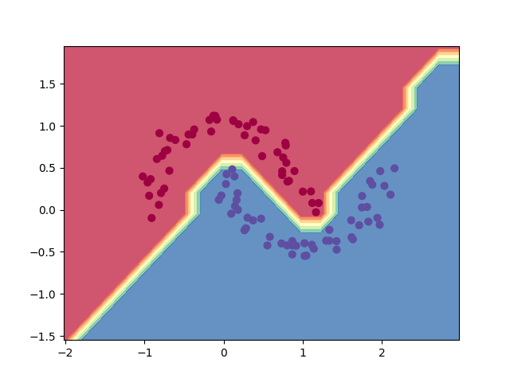
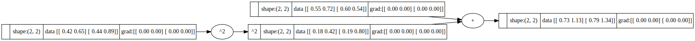

# Tensorgrad

A tiny Tensorgrad engine, which is inspired by [micrograd](https://github.com/karpathy/micrograd) of karpathy, which is great work for educational purposes.
The only difference from micrograd of karpathy is that we support operate on tensor based on numpy.ndarray, which is more similar to PyTorch and much faster than micrograd,  while micrograd is only support scalar value.

Implements backpropagation over a dynamically built DAG and a small neural networks library on top of it  
with a PyTorch-like API.


### Example usage

Below is a slightly contrived example showing a number of possible supported operations:

```python
from micrograd.graph_utils import draw_dot_tensor

a = Tensor(np.random.random((2,3)))
b = Tensor(np.random.random((2,3)))
c = a + b
d = a * b + b ** 3
e = c + d
f = e**2/4
#f = e*e/4
g = Tensor(np.random.random((3,4)))
h = f@g
i = Tensor(np.random.random(4))
j = h + i.relu() # broadcast, h:[2,4], i:[4], j:[2,4]
k = j.tanh()
L = k.sigmoid()
a_g_tensor = a.grad
b_g_tensor = b.grad

L.backward()
print("a:",a.grad)
print("b:",b.grad)
print("c:",c.grad)
print("e:",e.grad)

# visualize the graph
L_dot = draw_dot_tensor(L)
L_dot.view()
```

### Loss functions
As only for education purpose, the work supports sigmoid/softmax cross entropy loss, mean square loss.


### Training a neural net

The file `test/test_network.py` provides a full demo of training an 2-layer neural network (MLP) binary classifier. This is achieved by initializing a neural net from `tensorgrad.network` module,

implementing a simple sigmoid cross entropy loss and using SGD for optimization.  
As shown in the test code, using a 2-layer neural net with two 16-node hidden layers  
we achieve the following decision boundary on the moon dataset:



### Tracing / visualization

For added convenience, the file `graph_utils.py` produces graphviz visualizations.  
E.g. this one below is of a simple 2D neuron-net work, arrived at by calling `draw_dot_tensor` on the code below,  and it shows both the data shape.


```python
np.random.seed(0)
a = Tensor(np.random.random((2,3)))
b = Tensor(np.random.random((2,3)))
c = a + b
d = a * b + b ** 3
d_dot = draw_dot_tensor(d)
d_dot.view()
```


### Related work
[micrograd](https://github.com/karpathy/micrograd)

### License

MIT
